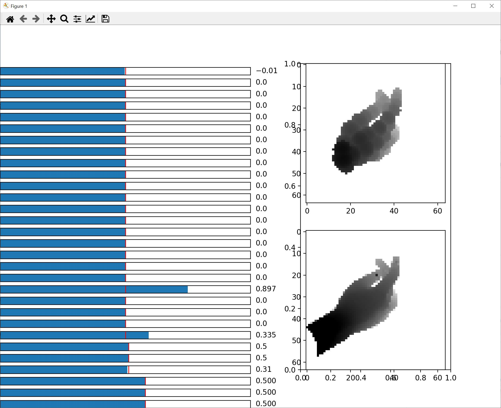

# Self-supervised 3d hand pose estimation through training by fitting

## pre-requisite
Python 3.7 or later

Pytorch 1.8 or later

We are using CUDA 10.2 for experiments, but should be compatible with CUDA 11 but not yet tested.

## cuda kernel install
We use a customized pytorch kernel for depth image rasterization in order to generate synthetic depth image and train the neural network. In current version, there is no CPU kernel available. The CUDA kernel has to be installed via following commands before training the network:
```bash
cd mesh/cuda_kernel
python3 setup.py install
```

## interactive viewer
After the cuda kernel is installed, one can open an interactive viewer from ipython shell via ``%run mesh/interactive_viwer.py``.



The bars in left column correspond to pose parameters (wrist transformation and joint angles) which can be dragged to adjust the value.

The right top figure corresponds to the sphere rendered hand, and right bottom corresponds to the depth image.


## prepare the dataset
After downloading and decompressing the NYU dataset, run ``python3 dataset/nyu_generator.py --nyu_path path/to/nyu_dataset`` to generate the torch dataset for NYU dataset.

## evaluate the model
To evaluate the model, open `network/run_engine.py`, change the `default_dataset_path` to the location of nyu torch dataset, and `default_model_path` to the where the trained model and visualizations will be saved.

Run the command
``
python3 network/run_engine.py --initial_model "pretrained/self-supervised.pth"
``
to evaluate the self supervised model, or

``
python3 network/run_engine.py --initial_model "pretrained/synthetic.pth"
``
to evaluate the model trained with only synthetic data, which is used as initialzation model for self-supervised training.

## train the model
To train the model via self-supervised learning, run
``
python3 network/run_engine.py --initial_model "pretrained/synthetic.pth" --model "Train"
``
to fine tune the intial model trained with synthetic data via self-supervised learning.

To train with only synthetic data, the options for self supervision loss have to be turned off with:
``
python3 network/run_engine.py --mode "Train" --"mv_consistency" --"mv_projection" --"prior" --"collision" --"bone_length"
``


